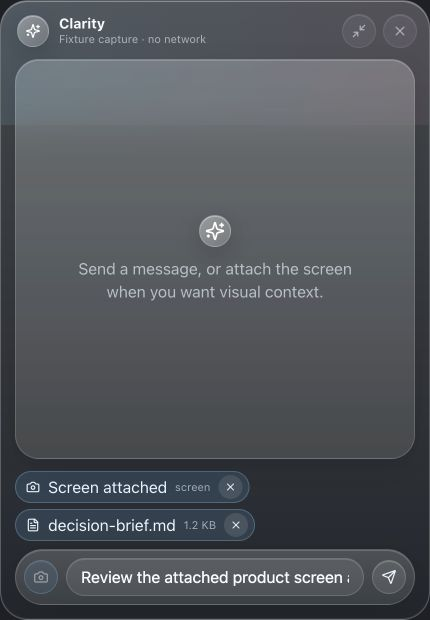
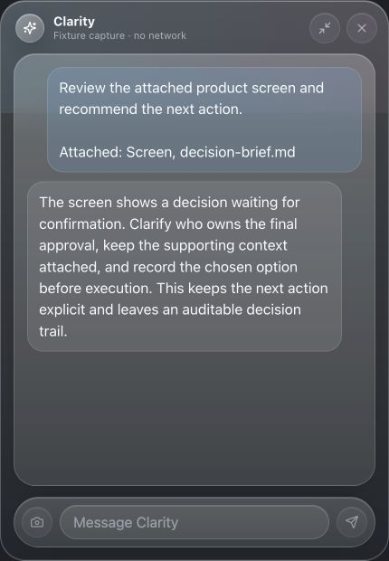
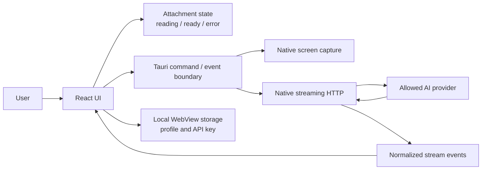

# Clarity

> **Personal desktop vision assistant** — 화면과 문서의 맥락을 대화에 연결하는 Tauri + React 데스크톱 앱

Clarity는 사용자가 요청한 순간의 화면 캡처와 문서 첨부를 AI 대화에 바로 연결하는 개인용 데스크톱 앱입니다. React 인터페이스는 대화와 상태를 담당하고, Tauri/Rust 레이어는 화면 캡처와 허용된 AI 제공자에 대한 네이티브 스트리밍 요청을 담당합니다.

> 이 프로젝트는 개인 프로토타입입니다. 실제 사용자 수·업무 영향·운영 안정성은 주장하지 않습니다.

## 화면

| 화면·문서 첨부 | 응답 검토 |
| --- | --- |
|  |  |
| 실제 UI · 합성 화면과 문서 · 네트워크 호출 없음 | 실제 UI · 합성 첨부와 응답 · 네트워크 호출 없음 |

## 주요 사용자 흐름

1. 사용자가 제공자·모델·API 키로 로컬 프로필을 만듭니다.
2. 평소에는 커서 옆을 따라다니는 작은 오브만 보입니다. 수정키(기본 Option/Alt, 설정에서 Cmd/Ctrl로 변경)를 누른 채 클릭하면 패널이 열리고, 드래그하면 선택한 영역이 첨부된 채 열립니다. 전역 단축키로 전체 화면이나 영역을 캡처할 수도 있고, 이미지·PDF·DOCX·텍스트 파일도 첨부할 수 있습니다.
3. 첨부 항목을 `reading`, `ready`, `error` 상태로 정규화하고 준비된 항목만 요청에 포함합니다.
4. 질문을 보내면 Tauri의 네이티브 HTTP 경계가 허용된 제공자로 요청을 보내고, 스트리밍 응답을 공통 대화 상태로 반영합니다.

## 기술 스택

- **UI**: React, TypeScript, Vite
- **Desktop shell**: Tauri v2, Rust
- **Context**: 다중 모니터 화면 캡처, 이미지·텍스트·PDF·DOCX 첨부
- **AI providers**: OpenAI, Anthropic, Google Gemini, OpenRouter
- **Quality**: Vitest, React Testing Library

## 아키텍처와 데이터 흐름



Tauri의 네이티브 레이어는 화면 캡처와 허용된 제공자 URL에 대한 HTTP 스트리밍만 담당합니다. UI는 제공자별 요청·스트림 형식을 어댑터에서 정규화한 뒤 공통 상태 전이로 처리합니다.

## 기술적 결정

### 시스템 기능을 좁은 네이티브 경계로 분리

화면 캡처와 스트리밍 HTTP는 운영체제 권한·네이티브 처리가 필요하지만, 대화 UI까지 Rust에 묶을 필요는 없었습니다. 그래서 React는 제품 UI와 상태를 맡고, Tauri command/event는 캡처·권한·스트림 전달만 맡도록 나눴습니다.

### 서로 다른 제공자 스트림을 공통 상태로 통합

제공자마다 요청 본문과 스트림 이벤트 형식이 다릅니다. 제공자별 요청 생성과 이벤트 파서를 어댑터로 분리하고, 정규화된 델타를 공통 reducer에 전달해 UI가 `capturing`, `streaming`, `ready`, `error` 상태에 집중하게 했습니다.

### 첨부를 전송 전에 검증 가능한 상태로 만들기

PDF·DOCX·이미지가 한꺼번에 들어오면 읽기 실패 또는 크기 제한을 요청 뒤에 발견하기 쉽습니다. 각 첨부를 준비 상태로 분류하고, 준비 완료된 항목만 메시지 컨텍스트에 넣어 조용한 누락을 줄였습니다.

## 로컬 실행

### 요구 사항

- Node.js와 npm
- Rust toolchain
- 대상 OS의 [Tauri v2 prerequisites](https://v2.tauri.app/start/prerequisites/)

```bash
npm ci
npm run tauri:dev
```

첫 실행에서 제공자·모델·API 키를 입력합니다. API 키는 저장소에 넣지 않으며, 실제 화면 또는 문서를 캡처할 때는 전송 전에 대상 제공자의 데이터 정책을 직접 확인해야 합니다.

### 패키징

```bash
# Windows
npm run package:windows

# macOS
npm run package:macos
```

`v*` 태그를 푸시하면 GitHub Actions가 Windows 설치 파일과 macOS 유니버설 DMG를 빌드해 [GitHub Releases](https://github.com/hssong43/clarity/releases)에 초안으로 올립니다. 절차와 서명 상태는 [docs/RELEASE.md](docs/RELEASE.md)를 참고하세요. 저장소의 `release/` 폴더에 있던 기존 설치 파일은 보존하며, Git 히스토리를 재작성하지 않습니다.

## 테스트와 CI

```bash
npm test
npm run build
```

단위 테스트는 대화 상태 전이, 프로필 직렬화, SSE 파싱, 첨부 처리, 제공자별 요청·응답 정규화를 다룹니다. GitHub Actions는 pull request와 `main` 푸시마다 lint·포맷 검사, 테스트, 프론트엔드 빌드, Rust 검사(fmt·clippy·test)를 실행합니다.

## 현재 한계와 보안 경계

- API 키는 OS 자격 증명 저장소(macOS 키체인, Windows 자격 증명 관리자, Linux Secret Service)에 보관되고, 요청 시 네이티브 레이어가 직접 인증 헤더를 붙입니다. 이전 버전에서 `localStorage`에 저장된 키는 첫 실행 때 자동으로 옮겨집니다. 단, 자격 증명 저장소를 쓸 수 없는 환경에서는 키가 기존처럼 `localStorage`에 평문으로 남습니다. 프로필 이름·모델 같은 나머지 정보는 계속 `localStorage`에 저장됩니다.
- 화면 캡처와 첨부는 사용자가 요청을 보낼 때 선택한 외부 AI 제공자에 전송될 수 있습니다. 민감한 화면·문서는 전송하면 안 됩니다.
- 제공자 정책, 네트워크 오류, 장시간 운영 시나리오는 별도 검증이 필요합니다.
- 실제 사용자·조직에 대한 도입 성과나 보안 인증을 주장하지 않습니다.

## 관련 링크

- [Portfolio case study](https://hyunseok-portfolio.broken-paper-9ee3.workers.dev/projects/clarity)
- [Release notes](docs/RELEASE.md)
